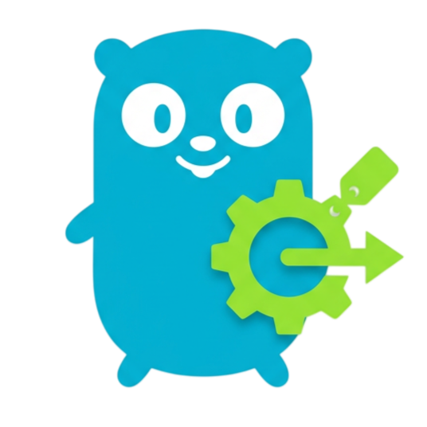
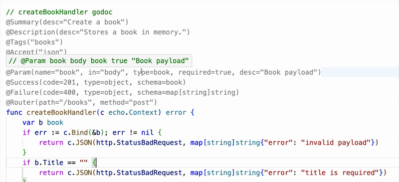
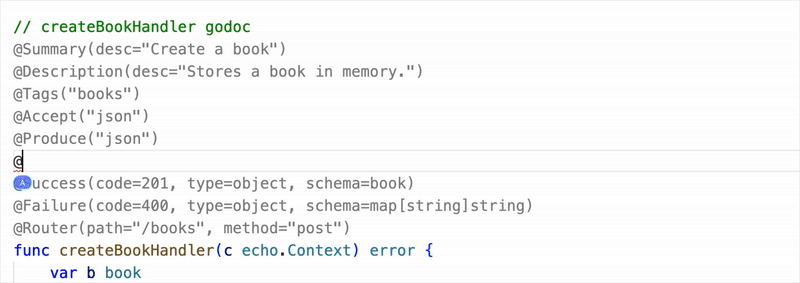
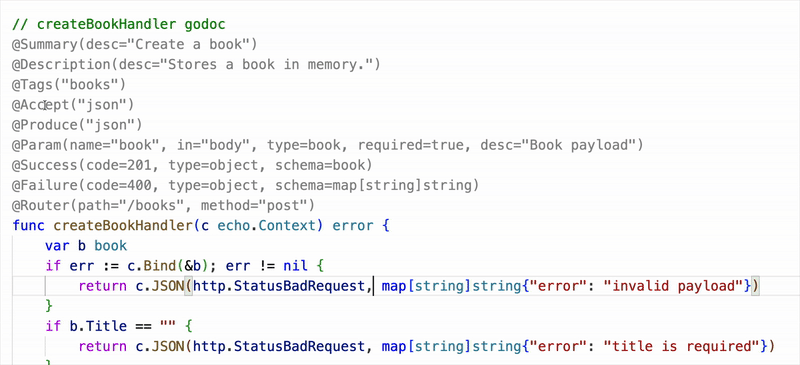

# Swaggo - GoSwagger Genie for VS code.
 <br/>
GoSwagger Genie for VS Code. `@Tag(...)` 또는 `#Tag(...)` 형태의 가상 어노테이션을 입력하면, 자동으로 Go Swagger 주석(`// @Tag ...`)으로 변환합니다. 에디터에서는 Swagger 주석을 다시 가상 어노테이션 형태로 렌더링해 읽기 쉽고 수정하기 쉽습니다.

⚠️ 주의: 이 도구는 Go에 어노테이션을 도입하지 않습니다.
표준 swaggo 주석으로 변환되는 에디터 친화적인 입력 문법만을 제공합니다.

## 목차

- 소개
- 주요 기능
- 사용 방법
- 지원하는 어노테이션 문법
- 어노테이션 파싱 규칙
- 진단(Diagnostics)
- 스니펫
- 개발
- 비고

## 소개


기존의 `// @Param ...` 주석은 인자 순서를 기억해야 하고, 값이 무엇을 의미하는지 매번 해석해야 했습니다. `swaggo`는 `@어노테이션(키=값)` 문법을 제공해 의미를 명확히 하고, IDE의 타입 추론과 자동완성으로 구조체/스키마를 빠르게 작성할 수 있게 합니다. 또한 마우스 호버로 변환된 Swagger 주석을 확인할 수 있어 결과를 즉시 검증할 수 있습니다.

## 주요 기능
- 주석 렌더링: `// @Tag ...` 주석을 가상 어노테이션 형태로 표시.
- 명시적 문법: `@어노테이션(키=값)`으로 어떤 값인지 한눈에 파악.
- IDE 친화성: `@어노테이션` 이름 자동완성, `@어노테이션(키)` 자동완성, 타입 추론 지원.
- 가상 어노테이션 수정: 가상 `@어노테이션`을 직접 수정할 수 있음

- 즉시 변환: 입력 즉시 `// @Tag ...` 형식으로 변환.

- 호버 미리보기: 마우스를 올리면 변환된 Swagger 주석을 확인.

- 기본 패턴 진단: `package.Type` 또는 `package.Function` 형태를 정규식으로 검사.
- 스니펫 제공: 자주 쓰는 GET/POST 템플릿.

## 사용 방법

### 1) 입력 예시

```txt
@Summary("클래스 생성")
@Description("클래스 생성 API")
@Tags("classroom", "admin")
@Accept("json")
@Produce("json")
@Param(name="body", in="body", type=dto.CreateClassroomRequest, required=true, desc="클래스 생성 요청")
@Success(code=200, schema=dto.ClassroomResponse, desc="클래스 생성 성공")
@Failure(code=400, schema=echo.HTTPError, desc="잘못된 요청")
@Router("/classrooms", "post")
```

### 2) 변환 결과

```txt
// @Summary 클래스 생성
// @Description 클래스 생성 API
// @Tags classroom,admin
// @Accept json
// @Produce json
// @Param body body dto.CreateClassroomRequest true "클래스 생성 요청"
// @Success 200 {object} dto.ClassroomResponse "클래스 생성 성공"
// @Failure 400 {object} echo.HTTPError "잘못된 요청"
// @Router /classrooms [post]
```

## 지원하는 어노테이션 문법

아래는 현재 지원하는 가상 어노테이션 태그와 기본 변환 규칙입니다.

### 기본 텍스트 계열

- `@Summary("텍스트")` → `// @Summary 텍스트`
- `@Description("텍스트")` → `// @Description 텍스트`
- `@ID("operationId")` → `// @ID operationId`
- `@Tags("tag1", "tag2")` → `// @Tags tag1,tag2`
- `@Accept("json", "xml")` → `// @Accept json xml`
- `@Produce("json")` → `// @Produce json`
- `@Schemes("http", "https")` → `// @Schemes http https`
- `@Security("ApiKeyAuth")` → `// @Security ApiKeyAuth`
- `@Deprecated()` → `// @Deprecated`

### Param

형식:

```txt
@Param("name", "in", type, required, "description")
```

변환:

```txt
// @Param name in type required "description"
```

예시:

```txt
@Param("id", "query", string, true, "사용자 ID")
```

```txt
// @Param id query string true "사용자 ID"
```

키=값 형태도 지원합니다 (순서 무관):

```txt
@Param(name="id", in="query", type=string, required=true, desc="사용자 ID")
```

### Success / Failure

형식:

```txt
@Success(code, schema, "description")
@Failure(code, schema, "description")
```

변환:

```txt
// @Success code {object} schema "description"
// @Failure code {object} schema "description"
```

본문 타입을 직접 지정할 수도 있습니다.

```txt
@Success(200, "array", dto.User, "OK")
```

```txt
// @Success 200 {array} dto.User "OK"
```

지원하는 본문 타입: `object`, `array`, `string`, `number`, `integer`, `boolean`

키=값 형태:

```txt
@Success(code=200, schema=dto.User, desc="OK")
@Success(code=200, type=array, schema=dto.User, desc="OK")
```

### Header

형식:

```txt
@Header(code, type, "name", "description")
```

변환:

```txt
// @Header code {type} name "description"
```

예시:

```txt
@Header(200, string, "Location", "redirect url")
```

```txt
// @Header 200 {string} Location "redirect url"
```

키=값 형태:

```txt
@Header(code=200, type=string, name="Location", desc="redirect url")
```

### Router

형식:

```txt
@Router("/path", "method")
```

변환:

```txt
// @Router /path [method]
```

예시:

```txt
@Router("/classrooms", "post")
```

```txt
// @Router /classrooms [post]
```

키=값 형태:

```txt
@Router(path="/classrooms", method="post")
```

## 어노테이션 파싱 규칙

- `@Tag(...)` 또는 `#Tag(...)` 모두 지원합니다.
- 문자열은 큰따옴표로 감싸는 것을 권장합니다.
- 콤마로 인자를 구분합니다.
- `true/false`, 숫자, 문자열이 혼합되어도 처리합니다.
- `Summary`, `Description`, `ID`, `Param`, `Success/Failure`, `Header`, `Router`는 `key=value` 형식도 지원합니다. (키는 대소문자 무시)
- `description`/`desc` 모두 인식하며 렌더링은 `desc`로 표시됩니다.

## 진단(Diagnostics)

- `package.Type` 또는 `package.Function` 형태를 기본 정규식으로 검사합니다.
- 형식이 맞지 않으면 해당 위치에 경고가 표시됩니다.
- 실제 Go 코드에 해당 타입이 존재하는지는 검사하지 않습니다.

## 스니펫

- `swagpost`: POST용 가상 어노테이션 블록
- `swagget`: GET용 가상 어노테이션 블록

## 개발

1. 의존성 설치: `npm install`
2. 빌드: `npm run compile`
3. 실행: VS Code에서 `F5`로 Extension Development Host 실행

## 비고

- 현재는 입력 즉시 변환됩니다.
- 필요 시 태그별 포맷 규칙을 추가로 확장할 수 있습니다.
- Swagger 주석 렌더링은 에디터에서만 보이며 파일 내용은 변경되지 않습니다.
